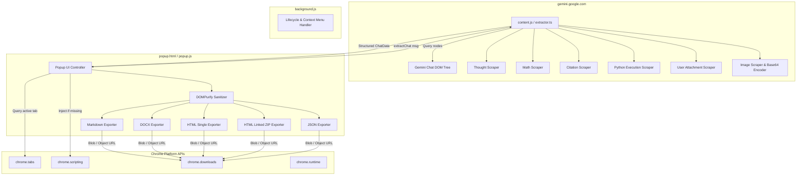
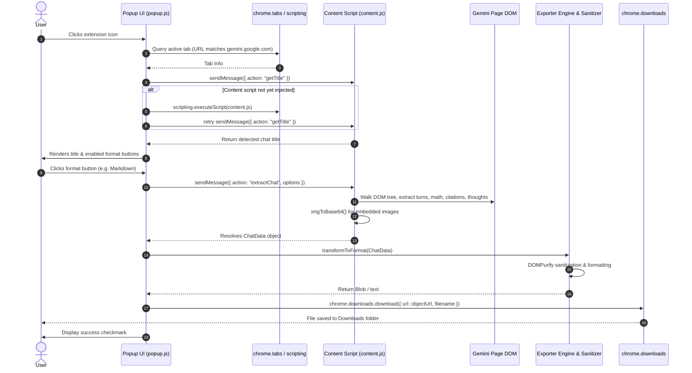

# Gemini Chat Exporter: Architecture Specification

## 1. Architectural Overview

**Gemini Chat Exporter** is a Manifest V3 Chrome extension architected to extract, normalize, and export structured conversations from Google Gemini (`https://gemini.google.com`) into multiple document formats entirely on the user's local machine.



---

## 2. Component Boundaries & Context Separation

### 2.1 Content Script Context (`src/content/`)
- **Execution Target:** Injected into `https://gemini.google.com/*` tabs.
- **Execution Model:** Runs in an isolated world with access to the Gemini web page's DOM.
- **Responsibilities:**
  - Locate conversation nodes (`user-query`, `model-response`).
  - Extract user prompt text and multimodal attachments (images, uploaded files, PDFs).
  - Extract model response text, HTML, and specialized children:
    - Thinking & reasoning traces (`<thought-box>`, `.thought-container`).
    - LaTeX / KaTeX mathematical formulas.
    - Code blocks and interactive Python execution output cells.
    - Web search citations, grounding chips, and source links.
  - Asynchronously fetch embedded response images (using session cookies) and convert them to base64 Data URIs with proper MIME types.
  - Return normalized, strongly typed `ChatData` JSON structure to the caller.

### 2.2 Popup Context (`src/popup/`)
- **Execution Target:** Opened when user clicks the extension action icon in the toolbar.
- **Execution Model:** Full DOM-enabled extension window (`popup.html`).
- **Responsibilities:**
  - Query the currently active Gemini tab via `chrome.tabs.query`.
  - Ensure `content.js` is active; on-demand inject via `chrome.scripting.executeScript` if the tab predates extension installation.
  - Request chat extraction via `chrome.tabs.sendMessage`.
  - Provide interactive user controls:
    - Export format triggers (Markdown, Word .docx, Single HTML, ZIP, JSON).
    - Export options (e.g. Include Thinking Process, Theme mode).
  - Execute exporter pipelines (`src/exporters/`) within the popup's DOM environment where `document`, `Blob`, `FileReader`, and `URL.createObjectURL` are available.
  - Dispatch file downloads via `chrome.downloads.download`.

### 2.3 Background Service Worker (`src/background/`)
- **Execution Target:** Ephemeral Manifest V3 background service worker.
- **Execution Model:** Event-driven, non-persistent, DOM-free background thread.
- **Responsibilities:**
  - Extension lifecycle management (install, update).
  - Optional context menu registration (e.g. "Export this chat").
  - Strictly **no** DOM manipulation or global in-memory state persistence.

---

## 3. Data Pipeline & Message Passing Flow



---

## 4. Normalized Data Schema (`ChatData`)

All scrapers produce and all exporters consume a unified, immutable TypeScript data schema:

```typescript
export interface Citation {
  index: number;
  title: string;
  url: string;
  snippet?: string;
}

export interface Attachment {
  type: 'image' | 'file' | 'audio';
  name?: string;
  src?: string;
  base64?: string;
  mimeType?: string;
}

export interface CodeBlock {
  language: string;
  code: string;
  executionOutput?: string;
}

export interface Turn {
  id: string;
  role: 'user' | 'model';
  timestamp?: string;
  text: string;
  html: string;
  thought?: {
    text: string;
    html: string;
    duration?: string;
  };
  attachments?: Attachment[];
  citations?: Citation[];
  codeBlocks?: CodeBlock[];
}

export interface ImageMeta {
  id: string;
  src: string;
  alt: string;
  base64: string | null;
  mimeType: string;
  ext: string;
}

export interface ChatData {
  title: string;
  url?: string;
  exportedAt: string;
  geminiModelVersion?: string;
  turns: Turn[];
  images: ImageMeta[];
}
```

---

## 5. Security & Privacy Architecture

1. **Zero External Network Calls:**
   - The extension makes **zero** outbound network requests to third-party servers, analytics services, or external APIs.
   - All transformations (Markdown, HTML, DOCX, ZIP, JSON) are computed entirely in memory on the client machine.
2. **Credentialed Image Fetching:**
   - Gemini images stored on internal Google CDNs require session cookies. `content.js` uses `fetch(img.src, { credentials: 'include' })` strictly for URLs already present in the Gemini DOM. Credentials are never stored, logged, or transferred.
3. **Defense-in-Depth HTML Sanitization:**
   - All HTML content rendered by Gemini is passed through DOMPurify before inclusion into exported HTML or DOCX files to prevent Cross-Site Scripting (XSS) vectors.
4. **Principle of Least Privilege:**
   - Host permissions are strictly locked to `https://gemini.google.com/*`.
   - Permissions are restricted to `downloads`, `scripting`, `activeTab`, and `tabs`.
